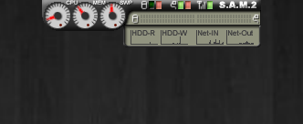
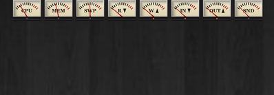
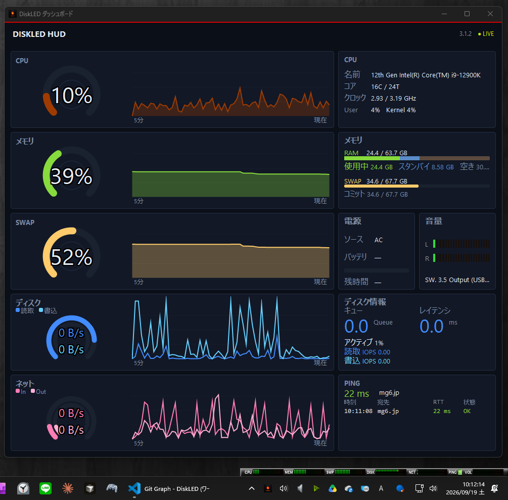

# DiskLED

[English](#diskled-english)

Windows XP 時代に Delphi 4.0 で作られた常駐モニター（HDD / ネットワーク / CPU / メモリ）を、現代の Windows（Windows 11 など）向けに基本設計から再構築したアプリケーションです。

 

## ダウンロード
- **Github** [リリースページ](https://github.com/soramimi6/DiskLED/releases)
- **Microsoft Store** [紹介ページ](https://apps.microsoft.com/detail/9NL8ZRTVVFJJ)

---

## 概要

- **開発環境**: Delphi Community Edition（個人開発・無料配布）／**VCL**・64-bit
- **対象**: Windows 10 / 11
- **外観**: ユーザー導入の旧スキン（`.dla`）は非対応。内部は **layout.cfg ベースの表示モード**（Original / Crystal / Metalic / Info Bar / Vintage）。`assets/<id>/layout.cfg` を足せばモード追加可能
- **更新頻度**: 最低 **10 fps**、デフォルト **15 fps**。見た目のコマが変わらないときは再描画しない
- **プロセス**: **単一起動のみ**（2つ目以降は起動を抑制し、既存へフォーカス等）
- **スケール**:
  - CPU / 物理メモリ / SWAP … 0～100%
  - ディスク／ネット速度 … デバイス上限 → だめなら実測オートセンス（手動レンジは二期）
  - Ping … 応答時間を 4 段階（正常／やや遅い／遅い／タイムアウト）で表示
- **非採用**: ユーザー向けスキン配布（`.dla`）、SSTP、**サウンド全般**、フローティング、複数起動、ダッシュボード描画の Direct2D 移行（レンダーターゲットのリサイズ／デバイスロスト管理がカード単位の独立ウィンドウ構成で煩雑化するため。GDI+ への統一に留める）
- **非採用（権限・API 方針上）**: アクセス中のファイル一覧（ETW カーネルプロバイダ＝管理者権限が必要）、メモリ内訳 Standby/Modified・GPU VRAM 内訳（いずれも非公開 API 依存。一般権限・公式 API 優先の方針に反する。GPU 使用率は PDH で公式に取れるため対象）

## 主な機能

「今アクセスしているか／どのくらい負荷か」が一目で分かる常駐デスクトップガジェット。

- 表示モード切替（Original / Crystal / Metalic / Info Bar / Vintage。Vintage はアナログ VU メーター風、3.1.2〜）
- 表示サイズ：コンパクト／フル／**タスクトレイ**（トレイアイコン自体がディスクアクセス LED）の排他 3 択（3.1.1〜）
- CPU、MEM、SWAP（仮想メモリ）メーター
- Disk R/W LED＋速度バー、Net 送受信 LED＋速度バー
- **Ping**：応答段階表示。専用ウィンドウで Tracert のようにホップごとの経路（TTL・IP・ホスト名・RTT）を表示（3.1.1〜）
- 最前面表示、トレイアイコン、スタートアップ登録、単一起動の強制
- 右クリックメニューから**位置をリセット**（画面外に外れた本体ウィンドウの復旧、3.1.1〜）
- **ダッシュボード**（別ウィンドウ）。CPU／メモリ／SWAP／ディスク／ネットのドーナツ・推移グラフ、**ディスクレイテンシ**（3.1.1〜）、電源（再生音量）、Ping 履歴などを表示

Crystal / Info Bar はコンパクトのみ。Vintage はフル表示ありだが推移グラフは無し。

### 監視対象

- **ディスク**: 全物理ディスクの I/O を**合算**（システム全体の「HDDランプ」相当）
- **ネットワーク**: **実 NIC のみ合算**（VPN・ループバック・仮想アダプタは除外を試みる）
- **Ping**: 指定ホスト（既定 **mg6.jp**）、またはデフォルトゲートウェイ自動検出。間隔は **最低 5 分**、閾値はオプションで変更可

### UI・描画

- **透過**: 旧スキン同様、カラーキー透過で非矩形ウィンドウを再現する
- **設定ファイル**: 基本は exe と同じフォルダの `DiskLED.ini`（書込不可時は `%AppData%\DiskLED\DiskLED.ini` へフォールバックする）
- **メーター追従**: 上昇は指数で速く、下降は定速の余韻（fps 非依存）。動きは表示モードの `layout.cfg` `[Ballistic]` で指定（3.0.1 以降）
- **対数スケール**: ネット速度はオプションで直線（既定）または対数。ディスクはオートセンスの直線。CPU／MEM／SWAP は常に直線
- **権限**: **管理者不要**で動く範囲に限定（ICMP Ping も一般権限で実施）

### 配布・その他

- **配布形態**:
  - 正式配布は **Inno Setup インストーラー**（`DiskLED_Setup_<version>.exe`、ユーザー権限・既定 `%LocalAppData%\Programs\DiskLED`）
  - 併せてポータブル zip（`DiskLED-<version>-portable.zip`）も利用可能
  - Microsoft Store 版も配布（Store 経由で自動更新）
- **言語**: 既定は英語。OS の UI 言語が日本語のときだけ日本語
- **ライセンス**: 著作権は SoRaMiMi（旧版開発者と同一）。`assets/` 以下も同様。公式配布物は無償利用可。ソースの改変・再配布は不可。改善・デバッグの協力は共同開発者（リポジトリ編集権限の付与）として行う。詳細は `LICENSE.txt`

---

# DiskLED (English)

[日本語](#diskled)

This application rebuilds a resident monitor (HDD / network / CPU / memory) originally written in Delphi 4.0 in the Windows XP era, from a fresh design for modern Windows (Windows 11 and others).

 

## Download
- **GitHub** [Releases page](https://github.com/soramimi6/DiskLED/releases)
- **Microsoft Store** [Store listing](https://apps.microsoft.com/detail/9NL8ZRTVVFJJ)

---

## Overview

- **Development environment**: Delphi Community Edition (personal development, free distribution) / **VCL** · 64-bit
- **Target**: Windows 10 / 11
- **Appearance**: User-supplied legacy skins (`.dla`) are not supported. Internally, display modes are **layout.cfg-based** (Original / Crystal / Metalic / Info Bar / Vintage). Modes can be added by placing `assets/<id>/layout.cfg`
- **Refresh rate**: Minimum **10 fps**, default **15 fps**. The window is not redrawn while sprite frames stay the same
- **Process**: **Single instance only** (later launches are suppressed and focus is given to the existing instance, etc.)
- **Scales**:
  - CPU / physical memory / SWAP … 0–100%
  - Disk / network speed … device maximum → if that fails, measured auto-sense (manual range is a later phase)
  - Ping … response time shown in 4 levels (OK / somewhat slow / slow / timeout)
- **Not adopted**: User-facing skin distribution (`.dla`), SSTP, **sound in general**, floating, multiple instances
- **Not adopted (privilege / API policy)**: List of files currently being accessed (ETW kernel provider = requires administrator rights), memory Standby/Modified breakdown and GPU VRAM breakdown (both depend on undocumented APIs, against the "prefer non-elevated, official APIs" policy; GPU utilization is in scope since PDH exposes it officially)

## Key features

A resident desktop gadget that shows at a glance whether something is being accessed and how much load there is.

- Display mode switching (Original / Crystal / Metalic / Info Bar / Vintage; Vintage is an analog VU-meter style, since 3.1.2)
- Display size: Compact / Full / **Task tray** (the tray icon itself becomes a disk-access LED), a mutually exclusive 3-way choice (since 3.1.1)
- CPU, MEM, SWAP (virtual memory) meters
- Disk R/W LED + speed bar, Net in/out LEDs + speed bar
- **Ping**: response-level display. A dedicated window shows the hop-by-hop route (TTL, IP, hostname, RTT) like Tracert (since 3.1.1)
- Always-on-top, tray icon, startup registration, enforce single instance
- **Reset position** from the right-click menu (recovers a main window that has drifted off-screen, since 3.1.1)
- **Dashboard** (separate window). Donut/history graphs for CPU / memory / SWAP / disk / network, **disk latency** (since 3.1.1), power (playback volume), Ping history, and more

Crystal / Info Bar are compact-only. Vintage has a full view but no history graph.

### What is monitored

- **Disk**: **Sum** of I/O of all physical disks (system-wide “HDD lamp” equivalent)
- **Network**: **Sum of real NICs only** (VPN, loopback, and virtual adapters are excluded where possible)
- **Ping**: Specified host (default **mg6.jp**), or auto-detect the default gateway. Interval is **at least 5 minutes**; thresholds can be changed in Options

### UI / drawing

- **Transparency**: Color-key transparency, like the old skins, to reproduce a non-rectangular window
- **Settings file**: Basically `DiskLED.ini` in the same folder as the exe (falls back to `%AppData%\DiskLED\DiskLED.ini` when that folder is not writable)
- **Meter follow**: Fast exponential rise, constant-speed fall (fps-independent). Motion is set per display mode in `layout.cfg` `[Ballistic]` (since 3.0.1)
- **Log scale**: Network speed can be linear (default) or logarithmic in Options. Disk stays auto-sense linear. CPU / MEM / SWAP stay linear
- **Privileges**: Limited to what works **without administrator** (ICMP Ping is also done as a standard user)

### Distribution and other

- **Distribution**:
  - Official distribution is the **Inno Setup installer** (`DiskLED_Setup_<version>.exe`, per-user, default `%LocalAppData%\Programs\DiskLED`)
  - A portable zip (`DiskLED-<version>-portable.zip`) is also available
  - Also distributed via the Microsoft Store (auto-updates through the Store)
- **Language**: English by default. Japanese only when the OS UI language is Japanese
- **License**: Copyright is SoRaMiMi (same as the previous version’s author). Same for `assets/`. Official packages may be used free of charge. Modification and redistribution of the source are not permitted. Help with improvements and debugging is as a co-developer (granted repository write access). Details in `LICENSE.txt`

