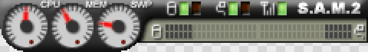
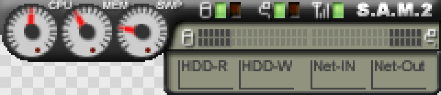

# Skin Gallery

[日本語](../SKIN_GALLERY.md)

Samples of DiskLED's five bundled display modes (skins). See [USAGE.md](USAGE.md)'s right-click menu section for how to switch between them, and [FEATURES.md](FEATURES.md) for full details on each. The images show sample values (fictional CPU/memory usage and disk/network activity), at the same actual size (1:1 pixels) they appear on your desktop.

## Original

 

- **Origin**: Ported from the legacy System Analog Meter II (sam2) skin
- **Size**: 240x34 compact / 240x52 full (toggle with left double-click)
- **Characteristics**: Analog needle meters. Full view adds a bar-style history graph
- **Meters**: CPU / memory / SWAP needle meters, disk read/write and network in/out activity LEDs, matching speed meters (liquid bar), Ping. Full adds a disk/network history graph

## Crystal

- **Origin**: Ported from the legacy Mac OS X-style skin (MacX)
- **Size**: 192x14 (compact only)
- **Characteristics**: The smallest of the bundled skins. Flat usage bars and small LEDs
- **Meters**: CPU / memory usage bars, disk read/write and network activity/in/out activity LEDs, Ping

## Metalic

 

- **Origin**: Ported from the legacy xsrv SkinS/SkinL skin
- **Size**: 256x24 compact / 256x48 full (toggle with left double-click)
- **Characteristics**: The most information-dense of the bundled skins, with a numeric percent readout baked into each usage bar. Full view adds a line-style history graph
- **Meters**: CPU / memory / SWAP usage bars (with numeric readouts), disk read/write/combined activity LEDs, network in/out/activity/total activity LEDs, Ping. Full adds a CPU/memory/SWAP history graph

## Info Bar

 

- **Origin**: New for DiskLED 3
- **Size**: 285x16 compact / 531x16 full (toggle with left double-click)
- **Characteristics**: A single horizontal information strip, the widest of the bundled skins. Full shows everything as horizontal LED bars; compact trims the set down and adds activity LEDs
- **Meters**: Compact = CPU usage bar, disk read/write and network in/out activity LEDs, Ping, playback volume L/R bars. Full = CPU/memory/SWAP usage bars, disk read/write and network in/out speed bars, Ping, playback volume L/R bars

## Vintage

 

- **Origin**: New for DiskLED 3
- **Size**: 232x32 compact / 416x32 full (toggle with left double-click)
- **Characteristics**: An analog VU-meter look, with the dial face, ticks, and needle baked into each of 64 frames for a smooth sweep
- **Meters**: Compact = CPU/memory usage, combined disk I/O and network I/O activity meters (the larger of read/write or in/out), playback volume (mono). Full = CPU/memory/SWAP usage, disk read/write and network in/out shown separately, playback volume (stereo L/R)
